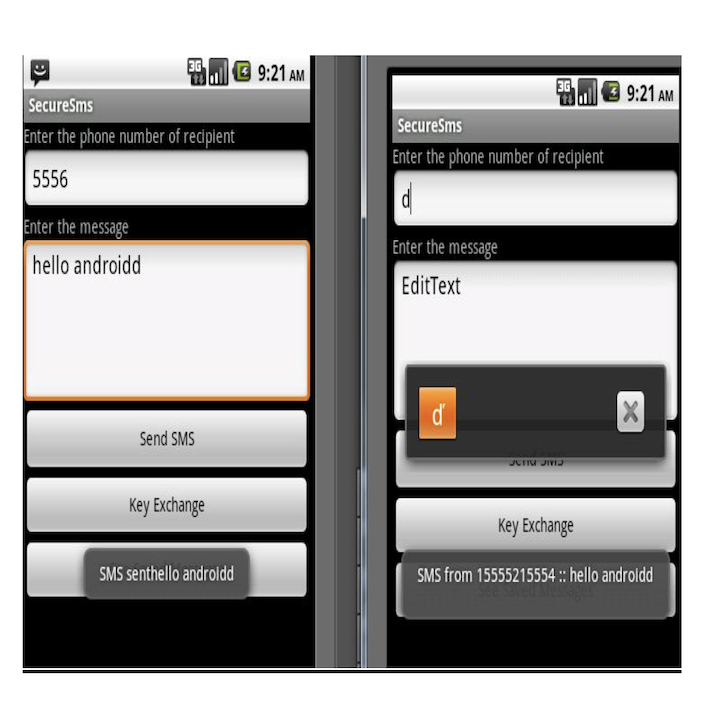

## Introduction

Peer-to-Peer (P2P) communication is a networking and distributed communication paradigm that enables the symmetric sharing of messages between two entities. Therefore, it is essential to ensure security against eavesdropping and electronic surveillance. Hence, I developed an Android application designed to help users share SMS securely without interception. The application implements a cryptographic technique that prevents the leakage of clear messages during transmission from one end to the other. This application provides the secure communication between two entities who wish to prevent third-party interception or comprehension of their messages.

## Implementation

#### Android
Android is a software stack for mobile devices that includes an operating system, middleware and key applications. The Android SDK provides the tools and APIs necessary to begin developing applications on the Android platform using the Java programming language. Android applications are coded in Java programming language. All the code after compiling goes to a file with extension “.apk” which is a installable file in android operating system to install an application. Once installed on a device, each Android application lives in its own security sandbox that  is it has it’s own virtual machine and work in isolation from other processes.

#### AES (Advanced Encryption Standard)

The Advanced Encryption Standard (AES) specifies a FIPS-approved cryptographic algorithm that can be used to protect electronic data. The AES algorithm is a symmetric block cipher algorithm that can encrypt (encipher) and decrypt (decipher) information. Encryption converts data to an unintelligible form called cipher text; decrypting the cipher text converts the data back into its original form, called plaintext

#### Diffie Hellman

Diffie Hellman is a protocol which allows two users to share a secret key, over an unsecure communication channel, without any prior secrets. The algorithm is based on exponentiation in a (galois) finite field over integers modulo a prime.

#### Approach Applied

The algorithm for the implementation of the project is as followed:
1. Firstly, the authorization of user by the application is essential. A user also have the option to change the password of the installed application.
2. If Authorized he/she may send or receive encrypted messages.
3. On the Sender’s end if a key is already present for encrypting the message for a session (session is defined until the start and beginning of application) for a particular receiver then user can directly send the encrypted message. Go to step 5.
4. Else sender has to first do the key exchange with the receiver. Then Go to Step 3.
5. On the Receiver’s end, when key not present and key exchange take place. It firstly receives a Key Exchange message having p, g, Y_a of the Deffie Hellman Key Exchange and index of p and g, it then calculates it’s Y_b then sends Y_b to the sender from which key exchange request was initialized. At initiator’s end the message received is Get_Yb message. Else the message will be encrypted message and receiver decrypt the message and displays it in Toast.
6. Further receiver can become sender and vice versa accordingly.
7. Any user can access the database where different senders have sent him the messages and he can also get access to the particular message and do delete operation on that message.

## Images

#### Flow Chart

#### Snapshots

  
  
  

## Further Work
The application can be further extended to do secure communication by means of calls also. That is if third party may tap the phone call then he/she may not understand the communication between the sender and receiver. Also, VOIP (Voice over Internet Protocol) can be done so that the messages are not being sent as sms, instead they are being sent through the socket where IP of the phone will be required.   

